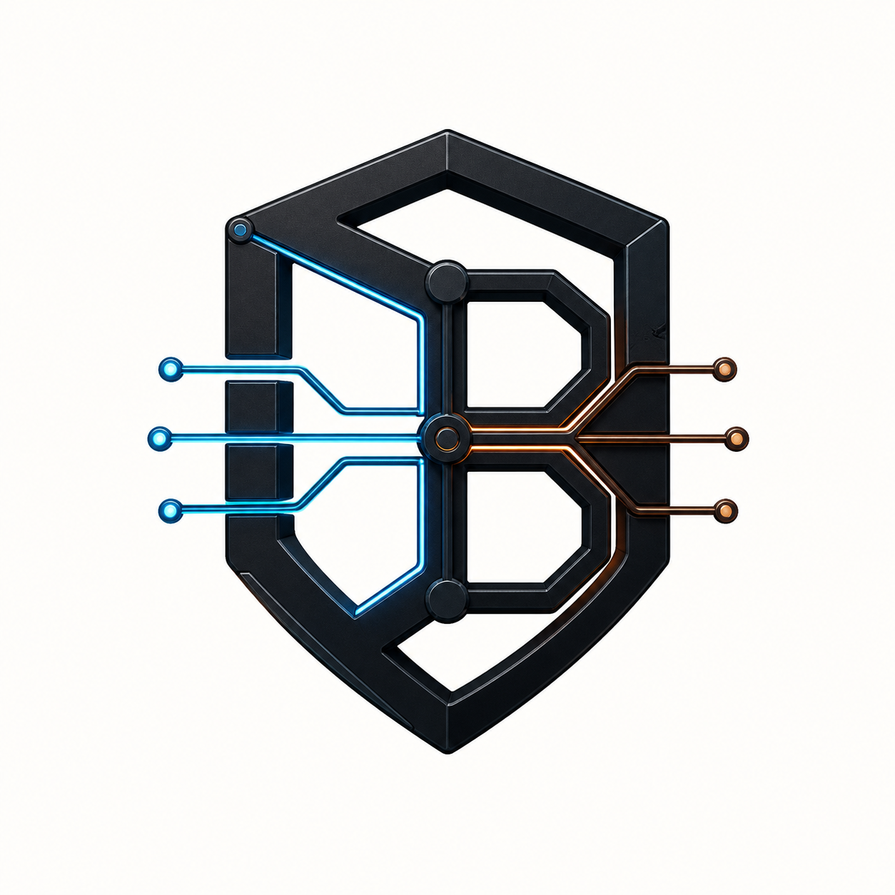

<p align="center">
  
</p>

# Blackwire

Blackwire is a Rust-native proxy runtime and control-panel project for personal
testing, labs, and controlled VPS experiments. It supports selected Xray-core and
sing-box compatible wire paths, but uses its own Blackwire JSON config schema
instead of accepting Xray or sing-box config files as drop-in input.

> Pre-production warning
>
> Blackwire is pre-1.0. Several protocol paths have strong tests and interop
> evidence, but the project is not production-ready software. Do not present or
> treat this repository as a stable production application. Use release
> candidates only for personal, lab, or tightly controlled deployments, and
> check the [release contract](docs/release.md) before relying on any path.

## Features

- Multi-protocol runtime: VLESS, VMess AEAD, Trojan, Shadowsocks 2022,
  Hysteria2, TUIC v5, SOCKS5, HTTP CONNECT, and selected tunnel/TUN paths.
- Modern transports and security: TCP, WebSocket, gRPC, HTTPUpgrade, SplitHTTP,
  mKCP, QUIC, TLS, REALITY, and ShadowTLS where documented as supported.
- Routing and DNS: domain/IP/port/source/inbound rules, geosite/geoip matching,
  DNS resolver support, FakeIP, sniffing, and adaptive failover.
- Local and server modes: run a local SOCKS/HTTP proxy, a VPS server, or a
  controlled test lab.
- Black UI companion panel: configure inbounds, outbounds, users, quotas,
  validation, live apply, service status, logs, and optional UFW port opening.
- Release installer: Linux amd64/arm64 assets, checksum verification, systemd
  unit, generated VPS configs, nginx/certbot domain setup, and optional Black UI.
- Evidence-first validation: CI, Rust tests, Docker interop, Lima VM checks,
  optional two-VPS validation, performance reports, and release gates.

## Current Release Support

| Status | What it means |
| --- | --- |
| Supported | Release-candidate supported for documented personal, lab, or controlled deployments. |
| Experimental | Implemented, but missing soak, hostile-network, observability, or breadth proof. |
| Unsupported | Not implemented, intentionally out of scope, or rejected by validation. |

The exact contract is in [Release Guide](docs/release.md), with detailed
evidence in [Feature Matrix](docs/feature-matrix.md).

## Quick Install

Linux release candidates can be installed from GitHub Releases for evaluation:

```sh
curl -fsSL https://raw.githubusercontent.com/mojindri/Blackwire/v0.1.0-rc.5/scripts/install.sh \
  | VERSION=v0.1.0-rc.5 bash
```

By default the installer installs the binary and systemd unit, but does not
start the service until a valid config exists.

Install and validate an existing config:

```sh
curl -fsSL https://raw.githubusercontent.com/mojindri/Blackwire/v0.1.0-rc.5/scripts/install.sh \
  | VERSION=v0.1.0-rc.5 CONFIG_PATH=/path/to/config.json START_SERVICE=1 bash
```

Generate a VLESS REALITY VPS config:

```sh
curl -fsSL https://raw.githubusercontent.com/mojindri/Blackwire/v0.1.0-rc.5/scripts/install.sh \
  | VERSION=v0.1.0-rc.5 SETUP=reality PUBLIC_HOST=example.com START_SERVICE=1 bash
```

Generate a domain + nginx + TLS setup:

```sh
curl -fsSL https://raw.githubusercontent.com/mojindri/Blackwire/v0.1.0-rc.5/scripts/install.sh \
  | VERSION=v0.1.0-rc.5 SETUP=domain DOMAIN=proxy.example.com PROXY_PATH=/secret-path INSTALL_NGINX=1 INSTALL_CERTBOT=1 START_SERVICE=1 bash
```

More install paths are in the [User Guide](docs/user-guide.md#install).

## After Install

Check the service:

```sh
sudo systemctl status blackwire --no-pager
sudo journalctl -u blackwire -n 100 --no-pager
```

For generated VPS configs, read the generated client details:

```sh
sudo cat /etc/blackwire/client-info.txt
```

For domain setup, nginx owns public HTTPS and Blackwire listens behind it on
localhost:

```sh
sudo nginx -t
curl -I https://proxy.example.com/
```

## Black UI Panel

Install the companion panel with the release assets:

```sh
curl -fsSL https://raw.githubusercontent.com/mojindri/Blackwire/v0.1.0-rc.5/scripts/install.sh \
  | VERSION=v0.1.0-rc.5 INSTALL_BLACK_UI=1 bash
```

With the domain setup, Black UI is reverse-proxied at `/panel/`:

```sh
curl -fsSL https://raw.githubusercontent.com/mojindri/Blackwire/v0.1.0-rc.5/scripts/install.sh \
  | VERSION=v0.1.0-rc.5 SETUP=domain DOMAIN=proxy.example.com PROXY_PATH=/secret-path INSTALL_NGINX=1 INSTALL_CERTBOT=1 INSTALL_BLACK_UI=1 START_SERVICE=1 bash
```

Keep Black UI bound to localhost unless it is behind hardened HTTPS access
control. See [Black UI](docs/user-guide.md#black-ui).

Open the panel at:

- local/default install: `http://127.0.0.1:18080`
- domain setup: `https://proxy.example.com/panel/`

## Common Operations

```sh
blackwire version
blackwire test -c /etc/blackwire/config.json
sudo systemctl status blackwire --no-pager
sudo systemctl restart blackwire
sudo journalctl -u blackwire -f
sudo cat /etc/blackwire/client-info.txt
```

Installed-service usage is in [Operate The Service](docs/user-guide.md#operate-the-service).

## Configuration

Blackwire configs are native JSON. Start with the beginner guide:

- [Configuration](docs/user-guide.md#configure)
- [Config For Dummies](docs/08-config-for-dummies.md)
- [Feature Matrix](docs/feature-matrix.md)

Useful example configs:

- [VLESS Client/Server](examples/vless-client-server/README.md)
- [REALITY Client/Server](examples/reality-client-server/README.md)
- [Hysteria2 Client/Server](examples/hysteria2-client-server/README.md)
- [VLESS + WebSocket Local](examples/vless-ws-local/README.md)
- [TUN Local](examples/tun-local/README.md)

## Supported Platforms

Release installer support:

- Linux `x86_64` / `amd64`
- Linux `aarch64` / `arm64`

Other runtime/test paths exist for macOS, Windows, and TUN, but follow the
support labels in [release.md](docs/release.md).

## Where To Go Next

- [User Guide](docs/user-guide.md) — install, operate, configure, troubleshoot, Black UI.
- [Release Guide](docs/release.md) — support contract and release process.
- [Feature Matrix](docs/feature-matrix.md) — detailed evidence and caveats.
- [Examples](examples/) — runnable starting configs.
- [Docs Index](docs/README.md) — developer, testing, performance, and roadmap docs.
