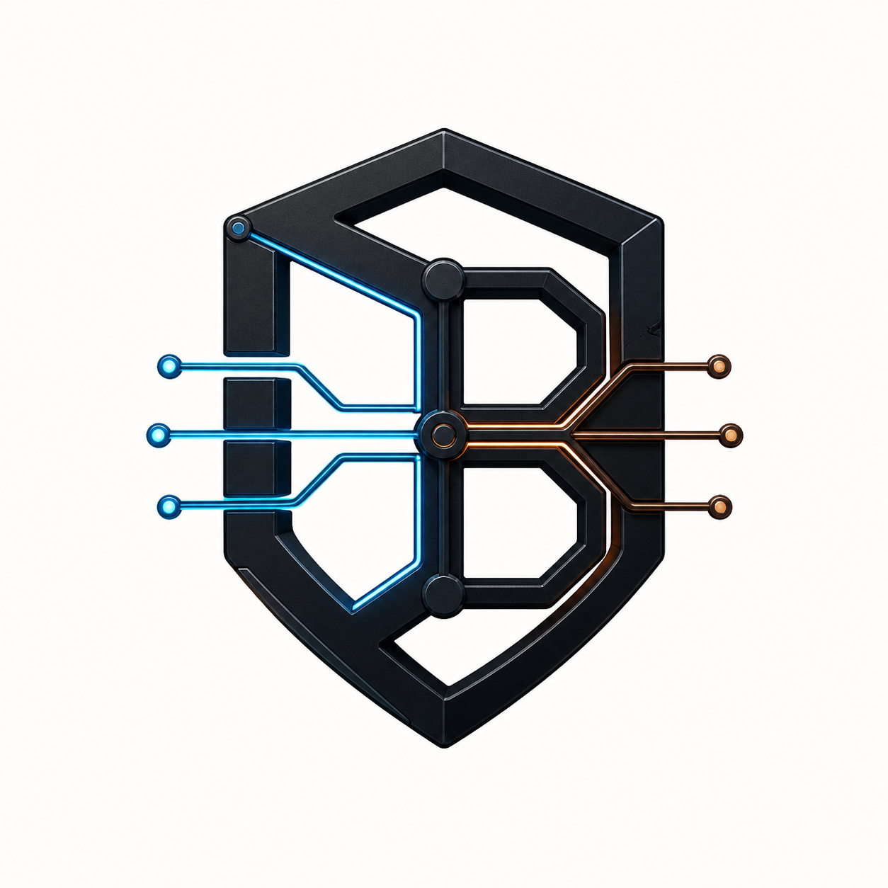

<p align="center">
  
</p>

# Blackwire

Blackwire gives you a Rust proxy runtime, a database-backed control plane, and
a typed web UI for personal, lab, and controlled VPS deployments. MySQL
8.4/InnoDB is the only persistent source of truth for your runtime, CLI, and
Black UI.

> Pre-production warning
>
> Blackwire is pre-1.0. Several protocol paths have strong tests and interop
> evidence, but it is not stable production software. Use it only for personal,
> lab, or tightly controlled deployments, and check the
> [release contract](docs/release.md) before relying on a protocol path.

## Features

- A MySQL-only control plane with separate runtime, UI, and migrator accounts.
- A typed Black UI for users, inbounds, outbounds, routing & DNS, runtime, and
  settings—without a raw server-configuration editor.
- Immutable configuration revisions, validation, rollback, controlled
  maintenance activation, and safe in-memory operation during a temporary
  database outage.
- Supported proxy protocols and transports documented with evidence in the
  [Feature Matrix](docs/feature-matrix.md).
- Hiddify-compatible client subscription content derived from your database
  configuration.
- Native systemd and Docker Compose deployment paths, plus CI, Rust tests, UI
  QA, and external-client interoperability checks.

## Current Release Support

| Status | What it means |
| --- | --- |
| Supported | Supported for documented personal, lab, or controlled pre-1.0 deployments. |
| Experimental | Implemented, but still missing soak, hostile-network, observability, or breadth proof. |
| Unsupported | Not implemented, intentionally out of scope, or rejected by validation. |

You can find the exact contract in the [Release Guide](docs/release.md), the
evidence and caveats in the [Feature Matrix](docs/feature-matrix.md), and
release-facing changes in the [Changelog](CHANGELOG.md).

## Quick Install

Before installing, you need a reachable MySQL 8.4 server and protected files
containing database URLs for the service accounts you use. Blackwire never
installs MySQL silently, and the runtime never migrates your schema at startup.

Download the current release installer, then provide the runtime credential
file explicitly:

```sh
curl -fsSLO https://raw.githubusercontent.com/mojindri/Blackwire/v0.2.5/scripts/install.sh
chmod +x install.sh
VERSION=v0.2.5 RUNTIME_DATABASE_URL_FILE=/secure/runtime-database-url ./install.sh
```

To have the installer apply migrations, opt in with a separate migrator
credential. To install Black UI, provide a separate UI credential as well:

```sh
RUNTIME_DATABASE_URL_FILE=/secure/runtime-database-url \
MIGRATOR_DATABASE_URL_FILE=/secure/migrator-database-url \
UI_DATABASE_URL_FILE=/secure/ui-database-url \
RUN_DB_MIGRATIONS=1 INSTALL_BLACK_UI=1 VERSION=v0.2.5 ./install.sh
```

Black UI is private on `127.0.0.1:18080` by default. To expose it on the
network, make that choice explicit. Provide the externally reachable panel
origin and the hostname or IP that proxy clients should use:

```sh
BLACK_UI_EXPOSURE=public \
BLACK_UI_PUBLIC_BASE_URL=http://PUBLIC_IP:18080 \
BLACK_UI_SUBSCRIPTION_HOST=PUBLIC_IP \
INSTALL_BLACK_UI=1 ... ./install.sh
```

This listens on `0.0.0.0:18080` by default; set `BLACK_UI_LISTEN` when you
need a specific interface or port. The public values are runtime overrides, so
an upgrade cannot leak an older loopback database default into copied or QR
subscription URLs. Put a public panel behind HTTPS and access control. MySQL
is unrelated and should remain private.

For Docker, use [the Compose deployment](deploy/docker/docker-compose.yml).
Create its documented secret files and export `BLACK_UI_PUBLIC_BASE_URL` and
`BLACK_UI_SUBSCRIPTION_HOST` before bringing the stack up. For a
development-only local URL, you can use `BLACKWIRE_DATABASE_URL`; use
protected `*_DATABASE_URL_FILE` credentials for deployed services.

## After Install

Confirm that the database and service are healthy:

```sh
blackwire db status
sudo systemctl status blackwire --no-pager
sudo journalctl -u blackwire -n 100 --no-pager
```

An empty inbound list is a valid idle control-plane state: Blackwire exposes no
proxy ports until you add one. Add your first inbound in Black UI, or start
with a relational preset:

```sh
blackwire db seed socks-local
blackwire db seed vless-local
blackwire db seed trojan-local
blackwire db seed shadowsocks-local
```

## Black UI Panel

Black UI manages Dashboard, Users, Inbounds, Outbounds, Routing & DNS,
Runtime, and Settings. Its forms create typed relational revisions, so you do
not need—or get—a raw server-configuration editor.

The native service binds Black UI to `127.0.0.1:18080` by default. Keep it
private or put it behind your own hardened HTTPS reverse proxy and access
control. In Users, choose **Copy subscription** to copy database-derived
client subscription content suitable for Hiddify.

## Common Operations

```sh
blackwire version
blackwire db validate
blackwire db status
blackwire db history --limit 20
blackwire db rollback REVISION
blackwire db activate-maintenance REVISION
blackwire explain-cost
sudo systemctl restart blackwire
sudo journalctl -u blackwire -f
```

Each UI or CLI edit creates an immutable revision. Blackwire polls MySQL,
validates it, then hot-swaps it, hands over a supported listener, or leaves it
pending until you confirm maintenance activation. It keeps serving the active
in-memory revision through a temporary database outage.

## Configuration

Configure Blackwire through Black UI or the database-backed CLI. You do not
edit or import raw runtime JSON. Legacy JSON and SQLite data are reported as
incompatible and left untouched; use MySQL dumps, snapshots, and binlogs for
database recovery. Revision history helps you roll back configuration, but it
is not a database backup.

- [User Guide](docs/user-guide.md) — configure, operate, and troubleshoot.
- [Config For Dummies](docs/08-config-for-dummies.md) — configuration concepts.
- [Feature Matrix](docs/feature-matrix.md) — supported paths and caveats.

Repository lab JSON files are bootstrap fixtures only. Lab scripts load them
into disposable MySQL databases with `blackwire db import-fixture`; do not use
that command as an automatic legacy migration path or against production data.

## Supported Platforms

The release installer supports Linux `x86_64`/`amd64` and
Linux `aarch64`/`arm64`. You can use other development and test paths on macOS
and Windows, subject to the support labels in [Release Guide](docs/release.md).

## Where To Go Next

- [User Guide](docs/user-guide.md) — install, operate, configure, troubleshoot, and Black UI.
- [Release Guide](docs/release.md) — support contract and release process.
- [Feature Matrix](docs/feature-matrix.md) — detailed evidence and caveats.
- [Docs Index](docs/README.md) — developer, testing, performance, and roadmap docs.

For development checks, run:

```sh
cargo check --workspace
cargo test --workspace
cd black-ui/frontend && npm run qa
```

Run MySQL integration tests against MySQL 8.4; SQLite is not a substitute.
