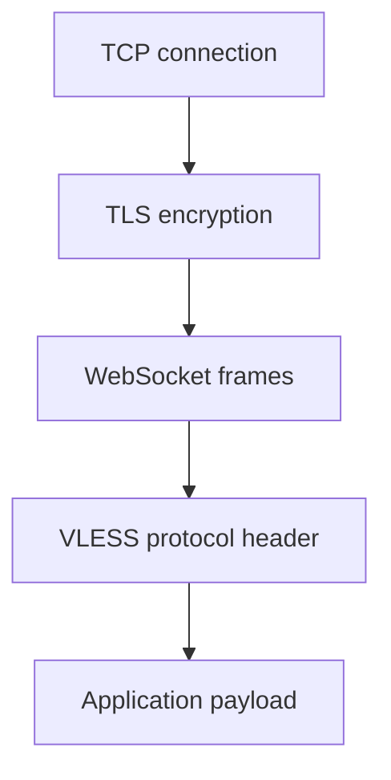
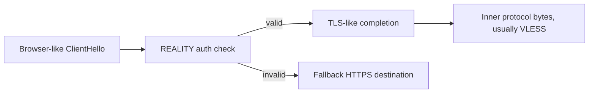
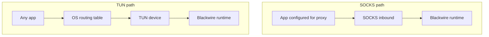

# Proxy Protocols And Transports From Scratch

This guide is for readers who know little or nothing about proxy systems.

The goal is not to memorize every byte of every protocol. The goal is to build
the mental model that lets you understand how Blackwire, V2Ray, Xray, sing-box,
and similar systems fit together.

By the end, these words should feel separate:

- client
- server
- inbound
- outbound
- protocol
- transport
- TLS
- routing
- relay
- TUN
- REALITY
- VLESS
- VMess
- Trojan
- Shadowsocks
- Hysteria2

## How To Use This Guide

If you are completely new, read sections 1 through 6 first and do not skip the
diagrams. Those sections build the basic mental model.

If you already understand normal proxies, start at section 8 for protocol names
and section 11 for transport names.

If you are trying to understand a config file, read sections 3, 4, 12, 13, and
19 together. Those explain how `protocol`, `streamSettings`, routing, and
outbounds fit together.

If you are debugging code, read the concept section first, then jump to the
source paths listed in section 18.

## 1. The Simplest Network Picture

Start with a normal app opening a website:

```text
browser -> example.com:443
```

The browser opens a TCP connection to `example.com` on port `443`.

For HTTPS, the browser then starts TLS on that TCP connection.

So the real shape is:

```text
browser -> TCP -> TLS -> HTTPS bytes -> website
```

A proxy adds a middle step:

```text
browser -> proxy -> website
```

The browser no longer connects directly to the website. It connects to the
proxy and tells the proxy:

```text
please connect to example.com:443 for me
```

Then the proxy connects to the website and relays bytes both ways.

## 2. What A Proxy Actually Does

Most proxy connections follow this pattern:

```text
client app
  -> local/client-side proxy protocol
  -> proxy runtime
  -> outbound connection
  -> destination or remote proxy server
```

Inside Blackwire, the common flow is:

```text
listener
  -> optional transport wrapper
  -> inbound protocol
  -> dispatcher
  -> router
  -> outbound protocol
  -> optional transport wrapper
  -> remote peer or final destination
```

That sounds complicated, but each piece has one job.

```mermaid
flowchart LR
    Client["Client app"]
    Listener["Listener"]
    TransportIn["Optional transport unwrap"]
    Inbound["Inbound protocol"]
    Router["Router"]
    Outbound["Outbound protocol"]
    TransportOut["Optional transport wrap"]
    Target["Remote peer or destination"]

    Client --> Listener --> TransportIn --> Inbound --> Router --> Outbound --> TransportOut --> Target
```



## 3. The Most Important Distinction: Protocol Vs Transport

People often mix these up.

### Protocol

A protocol says what bytes mean.

It answers questions like:

- who is the user?
- what destination does the client want?
- is this TCP or UDP?
- how is authentication encoded?
- where does the proxy header end and real payload begin?

Examples:

- SOCKS5
- HTTP CONNECT
- VLESS
- VMess
- Trojan
- Shadowsocks-2022

### Transport

A transport says how bytes are carried.

It answers questions like:

- is the connection raw TCP?
- is it wrapped in TLS?
- is it framed as WebSocket?
- is it running over QUIC/UDP?
- is it disguised as normal browser TLS?

Examples:

- TCP
- TLS
- WebSocket
- gRPC
- HTTPUpgrade
- SplitHTTP
- QUIC
- mKCP
- REALITY
- ShadowTLS
- TUN

### A Simple Analogy

Protocol is the language.

Transport is the road.

VLESS over WebSocket over TLS means:

```text
language: VLESS
road:     TLS, then WebSocket framing, then VLESS bytes inside it
```



## 4. Inbound And Outbound

Inbound and outbound are from the proxy's point of view.

### Inbound

Inbound means traffic entering this proxy.

Example:

```text
browser -> blackwire SOCKS inbound
```

The browser is the client. Blackwire accepts the connection.

### Outbound

Outbound means traffic leaving this proxy.

Example:

```text
blackwire VLESS outbound -> remote VPS VLESS inbound
```

Blackwire opens a connection to something else.

### Same Protocol Can Be Both

VLESS can be:

- inbound, when Blackwire is a server accepting VLESS clients
- outbound, when Blackwire is a client connecting to another VLESS server

Trojan and VMess can also be both.

SOCKS is usually local inbound.

Freedom is usually outbound only.

## 5. The Simplest Blackwire Setup

The simplest useful setup is:

```text
browser -> SOCKS inbound -> Freedom outbound -> website
```

Meaning:

1. Browser talks SOCKS5 to Blackwire.
2. Blackwire reads the SOCKS5 request.
3. Blackwire learns the destination, such as `example.com:443`.
4. Router chooses the `freedom` outbound.
5. Freedom opens a direct TCP connection to `example.com:443`.
6. Blackwire relays bytes both ways.

This is the best first mental model.

```text
SOCKS header says destination
Freedom connects directly
Relay copies bytes
```

## 6. What "Relay" Means

After the proxy header is done, most proxy systems just move bytes.

```text
client stream <-> remote stream
```

If the browser sends bytes, Blackwire sends them to the remote side.

If the remote side sends bytes, Blackwire sends them back to the browser.

For simple protocols like SOCKS, HTTP CONNECT, VLESS, and Trojan, the proxy
header is usually at the beginning. After that, the payload is mostly the real
application data.

Some protocols, like VMess and Shadowsocks-2022, keep framing and encrypting
payload chunks after the initial header.

## 7. One Complete Story: Browser To VPS To Website

This is the most common mental model for a personal VPS deployment.

Goal:

```text
browser on laptop -> local Blackwire -> VPS Blackwire -> website
```

One concrete stack:

```text
Browser
  -> local SOCKS inbound
  -> local router
  -> local VLESS outbound
  -> REALITY transport
  -> internet
  -> VPS REALITY server
  -> VPS VLESS inbound
  -> VPS router
  -> Freedom outbound
  -> youtube.com:443
```



```mermaid
flowchart LR
    Browser["Browser"]
    LocalSocks["Local SOCKS inbound"]
    LocalRouter["Local router"]
    LocalVless["Local VLESS outbound"]
    RealityClient["REALITY client transport"]
    Internet["Internet"]
    RealityServer["VPS REALITY server"]
    VpsVless["VPS VLESS inbound"]
    VpsRouter["VPS router"]
    Freedom["Freedom outbound"]
    Website["Website"]

    Browser --> LocalSocks --> LocalRouter --> LocalVless
    LocalVless --> RealityClient --> Internet --> RealityServer
    RealityServer --> VpsVless --> VpsRouter --> Freedom --> Website
```

Read that slowly:

1. The browser only knows about a local SOCKS proxy.
2. Local Blackwire turns the browser request into a VLESS outbound request.
3. REALITY hides/authenticates the connection to the VPS.
4. The VPS unwraps REALITY and then reads the VLESS request.
5. The VPS learns the final destination.
6. Freedom connects directly to that destination.
7. Both Blackwire instances relay bytes until the connection ends.

This is why the same product can be both client-side and server-side:

```text
local Blackwire: accepts SOCKS, sends VLESS
VPS Blackwire:   accepts VLESS, sends Freedom
```

The roles depend on where the instance sits in the path.

## 8. Local Proxy Protocols

These are commonly used by browsers, command line tools, and local apps.

### SOCKS5

SOCKS5 is a classic binary proxy protocol.

Typical flow:

```text
client -> proxy: supported auth methods
proxy  -> client: chosen auth method
client -> proxy: CONNECT example.com:443
proxy  -> client: success
client <-> proxy <-> destination: relay bytes
```

SOCKS5 is good for learning because it is simple:

- small handshake
- clear destination field
- supports domain names and IP addresses
- supports TCP CONNECT
- can support UDP ASSOCIATE

In Blackwire, SOCKS is usually a local inbound.

Code to read:

- `crates/blackwire-protocol/src/socks.rs`
- `crates/blackwire-protocol/src/socks5_udp.rs`

### HTTP CONNECT

HTTP CONNECT is a text-based proxy method.

The client sends:

```text
CONNECT example.com:443 HTTP/1.1
Host: example.com:443
```

If the proxy accepts, it replies:

```text
HTTP/1.1 200 Connection Established
```

After that, the connection becomes a raw tunnel.

HTTP CONNECT is common in browser and corporate proxy settings.

Beginner difference:

- SOCKS5 starts with binary fields.
- HTTP CONNECT starts with a text HTTP request.

Both eventually become:

```text
proxy knows destination -> proxy relays bytes
```

Code to read:

- `crates/blackwire-protocol/src/http_connect.rs`

## 9. Server Proxy Protocols

These are commonly used between a local client proxy and a remote VPS proxy.

### VLESS

VLESS is a lightweight proxy protocol from the V2Ray/Xray ecosystem.

The basic idea:

```text
client sends:
  version
  user UUID
  command
  destination
  options

then payload follows
```

VLESS does not try to do everything itself. It relies heavily on the transport
around it.

Common pairings:

- VLESS over TCP
- VLESS over TLS
- VLESS over WebSocket
- VLESS over gRPC
- VLESS over REALITY

Mental model:

```text
VLESS says who you are and where you want to connect.
The transport handles how that traffic looks on the network.
```

Why beginners should learn it early:

- simple header
- easy inbound/outbound symmetry
- common with REALITY
- less cryptographic machinery than VMess

Code to read:

- `crates/blackwire-protocol/src/vless/codec.rs`
- `crates/blackwire-protocol/src/vless/inbound.rs`
- `crates/blackwire-protocol/src/vless/outbound.rs`

### VMess

VMess is older and more complex.

VMess has:

- UUID-based user identity
- command key derivation
- auth ID generation
- encrypted request header
- framed/encrypted payload chunks

That means VMess is not just:

```text
header -> raw payload
```

It is closer to:

```text
auth -> encrypted header -> encrypted framed body chunks
```

VMess is useful for compatibility with V2Ray/Xray clients, but it is harder to
learn first.

Recommended learning order:

```text
SOCKS -> VLESS -> Trojan -> Shadowsocks-2022 -> VMess
```

Code to read:

- `crates/blackwire-protocol/src/vmess/auth.rs`
- `crates/blackwire-protocol/src/vmess/codec.rs`
- `crates/blackwire-protocol/src/vmess/stream.rs`

### Trojan

Trojan is designed around a simple idea:

```text
look like normal TLS-carried traffic, then send a small authenticated request
```

The Trojan protocol header includes:

- password-derived token
- command
- destination address
- destination port

Trojan is normally used over TLS.

Typical shape:

```text
TCP -> TLS -> Trojan header -> payload relay
```

Without TLS, Trojan loses much of its intended disguise story.

Mental model:

```text
Trojan is a small authenticated proxy request inside a TLS stream.
```

Code to read:

- `crates/blackwire-protocol/src/trojan/codec.rs`
- `crates/blackwire-protocol/src/trojan/inbound.rs`
- `crates/blackwire-protocol/src/trojan/outbound.rs`

### Shadowsocks-2022

Shadowsocks started as an encrypted proxy family. Shadowsocks-2022 is a modern
variant with a stronger session design.

It uses:

- pre-shared key
- per-session salt
- derived session subkeys
- AEAD encryption
- replay protection concerns
- encrypted chunk framing

Mental model:

```text
create encrypted session -> send encrypted target/header -> send encrypted chunks
```

It is not as simple as SOCKS or VLESS because encryption is part of the protocol
itself.

Code to read:

- `crates/blackwire-protocol/src/ss2022.rs`
- `crates/blackwire-protocol/src/ss2022/stream.rs`
- `crates/blackwire-protocol/src/ss2022/udp.rs`

### Hysteria2

Hysteria2 is built around QUIC and HTTP/3.

It is designed for difficult networks where UDP and congestion behavior matter.

It uses:

- QUIC as the base transport
- HTTP/3 authentication
- QUIC streams for TCP proxying
- QUIC datagrams for UDP proxying
- bandwidth/congestion tuning

Mental model:

```text
Hysteria2 is a proxy protocol family built on QUIC, not plain TCP.
```

Compared with VLESS over TCP, Hysteria2 has more transport behavior built into
the design.

Code to read:

- `crates/blackwire-transport/src/hysteria2/`
- `crates/blackwire-core/src/hysteria2.rs`

## 10. Direct Outbound: Freedom

Freedom is not really a remote proxy protocol.

It means:

```text
connect directly to the requested destination
```

If the destination is `example.com:443`, Freedom opens a TCP connection to
`example.com:443`.

Use cases:

- local direct proxy
- bypass rules
- test configs
- final exit path from a server

Mental model:

```text
Freedom is "no next proxy, just go directly."
```

Code to read:

- `crates/blackwire-protocol/src/freedom.rs`

## 11. Transport Basics

Now we move from protocol to transport.

Remember:

```text
protocol = what bytes mean
transport = how bytes are carried
```

### TCP

TCP is the normal reliable byte stream.

Most proxy protocols can run on TCP.

Shape:

```text
client -> TCP -> server
```

TCP gives ordered bytes. It does not hide anything by itself.

### TLS

TLS wraps a TCP stream with encryption.

Shape:

```text
client -> TCP -> TLS -> server
```

TLS gives:

- server certificate validation
- key exchange
- encrypted application data
- ALPN support

TLS is not a proxy protocol. It does not say what destination the proxy should
connect to.

You still need a protocol inside it:

```text
TCP -> TLS -> Trojan
TCP -> TLS -> VLESS
TCP -> TLS -> WebSocket -> VLESS
```

Common confusion:

```text
TLS encrypts a stream.
It does not tell the proxy where to connect.
```

### WebSocket

WebSocket starts as an HTTP request and upgrades into framed bidirectional data.

Shape:

```text
TCP -> optional TLS -> HTTP Upgrade -> WebSocket frames -> proxy protocol bytes
```

Why people use it:

- can pass through HTTP reverse proxies
- can share ports with web servers
- looks like web application traffic at a high level

Common pairing:

```text
VLESS over WebSocket over TLS
```

Code to read:

- `crates/blackwire-transport/src/ws.rs`

### HTTPUpgrade

HTTPUpgrade is similar in spirit to WebSocket: begin with HTTP, then upgrade.

It is used by some V2Ray/Xray transport paths.

Mental model:

```text
HTTP-looking handshake, then tunnel bytes
```

### gRPC

gRPC is built on HTTP/2.

In proxy transports, gRPC can carry proxy bytes inside HTTP/2 streams.

Shape:

```text
TCP -> TLS -> HTTP/2 -> gRPC stream -> proxy protocol bytes
```

Why it matters:

- can look like ordinary HTTP/2 service traffic
- works with some HTTP/2 infrastructure
- common in Xray/sing-box configs

Code to read:

- `crates/blackwire-transport/src/grpc.rs`

### SplitHTTP

SplitHTTP, also called xHTTP in some contexts, uses HTTP-style upload/download
channels.

Instead of one obvious long raw TCP stream, traffic is carried through HTTP
request/response behavior.

Modes can differ:

- stream-one
- packet-up

Mental model:

```text
proxy bytes split across HTTP-shaped channels
```

This is more advanced because the transport behavior affects buffering,
ordering, and upload/download flow.

### QUIC

QUIC is a UDP-based transport protocol with TLS 1.3 built in.

It provides:

- encrypted connections
- streams
- datagrams
- connection migration behavior
- congestion control

Shape:

```text
client -> UDP packets carrying QUIC -> server
```

QUIC is not just "TCP over UDP". It has its own connection model.

Hysteria2 and some V2Ray QUIC paths rely on QUIC behavior.

Code to read:

- `crates/blackwire-transport/src/quic.rs`

### mKCP

mKCP is KCP over UDP.

KCP is a reliable transport built on top of UDP.

Shape:

```text
client -> UDP -> KCP reliability/framing -> proxy bytes
```

Why use it:

- lossy networks
- custom reliability behavior
- compatibility with existing V2Ray mKCP clients

It is more advanced than TCP because packet loss, ordering, and retransmission
are handled by the transport implementation.

### REALITY

REALITY is one of the hardest pieces to understand because it overlaps with TLS
and camouflage.

Beginner version:

```text
REALITY makes a proxy connection look like a browser starting TLS to a real site.
```

It hides authentication material inside fields of a TLS ClientHello.

Valid client:

1. Builds a browser-like TLS ClientHello.
2. Puts REALITY auth material into normal-looking TLS fields.
3. Sends it to the server.
4. Server extracts and validates it.
5. If valid, server completes a TLS-like path and then passes application bytes
   to the inner protocol, usually VLESS.



Common pairing:

```text
VLESS over REALITY
```

Important:

REALITY is not the same thing as ordinary TLS.

Ordinary TLS says:

```text
encrypt this stream using certificates and negotiated keys
```

REALITY says:

```text
use a browser-like TLS handshake as camouflage and authentication
```

Common confusion:

```text
TLS is a standard encryption layer.
REALITY uses TLS-looking handshake behavior for camouflage and authentication.
```

Code to read:

- `crates/blackwire-transport/src/reality.rs`
- `crates/blackwire-transport/src/reality/client.rs`
- `crates/blackwire-transport/src/reality/server.rs`

### ShadowTLS

ShadowTLS is another camouflage transport.

High-level idea:

```text
relay or imitate a real TLS handshake, then switch to proxy data after proving knowledge of a shared secret
```

It is transport/security behavior, not a standalone proxy protocol.

Mental model:

```text
ShadowTLS wraps proxy bytes in a TLS-looking flow.
```

### TUN

TUN is different from the others.

SOCKS and VLESS are proxy protocols. TCP and WebSocket are transports.

TUN is an operating-system virtual network interface.

It receives IP packets, not just proxy connection streams.

Shape:

```text
app -> OS routing -> TUN device -> proxy runtime -> outbound
```



Why it matters:

- can capture traffic from apps that do not support proxy settings
- can behave more like a VPN path
- needs OS routing/firewall support

TUN is advanced because it involves:

- IP packet parsing
- TCP/UDP handling
- NAT tables
- platform routing rules
- bypass protection so proxy's own outbound traffic does not loop back

Common confusion:

```text
SOCKS is a proxy protocol.
TUN is a virtual network interface that receives IP packets.
```

Code to read:

- `crates/blackwire-transport/src/tun/`

## 12. How Protocols And Transports Combine

Now the important part: these pieces stack.

### Stack Builder Table

| Goal | Protocol choice | Transport choice | Beginner meaning |
| --- | --- | --- | --- |
| Local proxy only | SOCKS or HTTP inbound + Freedom outbound | TCP | Local apps use Blackwire as a normal proxy |
| Simple VPS proxy | SOCKS local inbound + VLESS outbound, VLESS server inbound + Freedom | TCP or TLS | Local machine sends proxy traffic to a VPS |
| Browser-like VPS proxy | VLESS | REALITY | Lightweight proxy protocol hidden in a REALITY/TLS-looking path |
| Reverse-proxy friendly | VLESS or VMess | WebSocket/TLS, gRPC/TLS, HTTPUpgrade, SplitHTTP | Proxy bytes ride through HTTP-shaped infrastructure |
| TLS-oriented simple server | Trojan | TLS | Trojan header is sent inside an encrypted TLS stream |
| UDP/bad-network path | Hysteria2 | QUIC/HTTP3 | QUIC-based proxying with datagrams and congestion behavior |
| Whole-device routing | Any selected outbound | TUN on the local side | OS packets enter Blackwire through a virtual interface |

### Example 1: Local Direct Proxy

```text
browser
  -> SOCKS5 inbound
  -> router
  -> Freedom outbound
  -> website
```

This has no remote proxy server.

It is good for learning and local routing.

### Example 2: Local Client To VPS With VLESS

Client machine:

```text
browser
  -> SOCKS inbound
  -> VLESS outbound
  -> TCP
  -> VPS
```

VPS:

```text
TCP listener
  -> VLESS inbound
  -> Freedom outbound
  -> website
```

Full path:

```text
browser -> local SOCKS -> local VLESS outbound -> VPS VLESS inbound -> Freedom -> website
```

### Example 3: VLESS Over WebSocket Over TLS

Client side:

```text
SOCKS inbound
  -> VLESS outbound
  -> WebSocket client
  -> TLS client
  -> TCP
```

Server side:

```text
TCP listener
  -> TLS accept
  -> WebSocket accept
  -> VLESS inbound
  -> Freedom outbound
```

Why use it:

- pass through HTTPS reverse proxy setups
- make traffic look HTTP/WebSocket-shaped
- share port 443 with a website

### Example 4: VLESS Over REALITY

Client side:

```text
SOCKS inbound
  -> VLESS outbound
  -> REALITY client transport
  -> TCP
```

Server side:

```text
TCP listener
  -> REALITY server validation
  -> TLS-like completion
  -> VLESS inbound
  -> Freedom outbound
```

Why use it:

- avoids exposing a plain proxy handshake
- looks closer to a normal browser TLS connection
- pairs well with lightweight VLESS

### Example 5: Trojan Over TLS

Client side:

```text
SOCKS inbound
  -> Trojan outbound
  -> TLS client
  -> TCP
```

Server side:

```text
TCP listener
  -> TLS accept
  -> Trojan inbound
  -> Freedom outbound
```

Why use it:

- Trojan expects TLS
- simple authenticated proxy header after TLS

### Example 6: Hysteria2

Client side:

```text
SOCKS inbound
  -> Hysteria2 outbound
  -> QUIC/HTTP3
  -> UDP
```

Server side:

```text
UDP listener
  -> QUIC endpoint
  -> HTTP/3 auth
  -> Hysteria2 TCP streams / UDP datagrams
  -> dispatcher
```

Why use it:

- bad network behavior
- UDP/QUIC paths
- explicit bandwidth and congestion handling

### Example 7: TUN Mode

```text
app
  -> OS sends packet through TUN
  -> Blackwire reads IP packet
  -> Blackwire creates/uses flow state
  -> router/outbound path
  -> remote server or destination
```

TUN is not just another proxy port. It is closer to taking over routing for
selected traffic.

## 13. Routing

Routing decides which outbound to use.

Example:

```text
if domain ends with ".local" -> direct
else -> vless-reality-out
```

Routing is not a protocol and not a transport.

It is decision logic.

Inputs can include:

- destination domain
- destination IP
- destination port
- source IP
- inbound tag
- sniffed protocol
- GeoIP/geosite match

Output is usually:

```text
outboundTag
```

Common confusion:

```text
Routing is not a transport.
Routing is the decision that chooses which outbound tag to use.
```

## 14. DNS And Sniffing

Proxy systems often care about domain names.

Sometimes the inbound request contains a domain:

```text
CONNECT example.com:443
```

Sometimes it contains only an IP:

```text
93.184.216.34:443
```

Sniffing tries to inspect early payload bytes to learn more.

Examples:

- HTTP Host header
- TLS SNI

This can help routing:

```text
traffic connected to an IP, but TLS SNI says "example.com"
```

Sniffing is useful, but it must be handled carefully because reading too much
or changing the stream can break protocols.

## 15. Authentication And Fallback

Proxy protocols need to reject invalid clients.

But rejection behavior matters.

Simple local protocols can fail directly:

```text
bad SOCKS request -> error
```

Public-facing camouflage protocols often try to avoid obvious failure signals.

Example:

```text
bad VLESS auth with fallback configured -> forward to fallback site
bad REALITY auth -> forward to fallback HTTPS destination
```

The goal is:

```text
invalid probes should not easily learn "this is a proxy"
```

This is why fallback behavior is part of the security story for some protocols.

## 16. UDP

TCP is stream-based.

UDP is packet/datagram-based.

That changes proxy behavior.

For TCP:

```text
open connection -> relay stream until close
```

For UDP:

```text
receive datagram -> remember session/flow -> send datagram -> route replies back
```

Protocols can support UDP in different ways:

- SOCKS5 UDP ASSOCIATE
- Trojan UDP frames
- VLESS UDP command
- VLESS XUDP
- Hysteria2 QUIC datagrams
- Shadowsocks-2022 UDP packets
- TUN UDP NAT

UDP is more complex because there is no built-in connection close signal like a
TCP stream. Implementations need idle timers and session tables.

## 17. What To Learn First

If you are a beginner, use this order:

1. Normal TCP and TLS basics.
2. SOCKS5 inbound to Freedom outbound.
3. HTTP CONNECT inbound to Freedom outbound.
4. VLESS inbound/outbound over plain TCP.
5. VLESS over WebSocket/TLS.
6. Trojan over TLS.
7. VMess AEAD.
8. Shadowsocks-2022.
9. REALITY.
10. Hysteria2 and QUIC.
11. TUN.
12. mKCP, SplitHTTP, ShadowTLS.

Do not start with REALITY, Hysteria2, or TUN. They combine too many ideas.

## 18. How To Read This Repo

Start with these docs:

1. [00-project-map.md](00-project-map.md)
2. [01-request-lifecycle.md](01-request-lifecycle.md)
3. [03-protocols-and-transports.md](03-protocols-and-transports.md)
4. [08-config-for-dummies.md](08-config-for-dummies.md)
5. this document

Then read code in this order:

1. `crates/blackwire-protocol/src/socks.rs`
2. `crates/blackwire-protocol/src/freedom.rs`
3. `crates/blackwire-app/src/dispatcher.rs`
4. `crates/blackwire-app/src/router.rs`
5. `crates/blackwire-protocol/src/vless/codec.rs`
6. `crates/blackwire-protocol/src/vless/inbound.rs`
7. `crates/blackwire-protocol/src/vless/outbound.rs`
8. `crates/blackwire-transport/src/tls.rs`
9. `crates/blackwire-transport/src/ws.rs`
10. `crates/blackwire-transport/src/reality.rs`

For advanced protocols:

- VMess: `crates/blackwire-protocol/src/vmess/`
- Trojan: `crates/blackwire-protocol/src/trojan/`
- Shadowsocks-2022: `crates/blackwire-protocol/src/ss2022/`
- Hysteria2: `crates/blackwire-transport/src/hysteria2/`
- TUN: `crates/blackwire-transport/src/tun/`

## 19. Configuration Words That Map To These Concepts

Blackwire config uses a few words over and over.

| Config word | Meaning |
| --- | --- |
| `protocol` | Which proxy protocol this inbound or outbound speaks |
| `settings` | Protocol-specific fields, such as users, UUIDs, passwords, or server address |
| `streamSettings` | Transport/security wrapper fields, such as WebSocket, TLS, REALITY, gRPC, or QUIC |
| `tag` | A local name for an inbound or outbound |
| `outboundTag` | The outbound chosen by routing |
| `inboundTag` | A routing match for traffic that entered through a specific inbound |
| `sniffing` | Early payload inspection for HTTP Host, TLS SNI, or FakeDNS metadata |
| `fallback` | Where some failed-auth or probe-like traffic is forwarded |

Tiny example:

```json
{
  "tag": "vless-reality-out",
  "protocol": "vless",
  "settings": {
    "address": "proxy.example.com",
    "port": 443
  },
  "streamSettings": {
    "network": "tcp",
    "security": "reality"
  }
}
```

Read it as:

```text
Use VLESS as the protocol.
Connect to proxy.example.com:443.
Carry it over TCP with REALITY security/transport behavior.
Call this outbound vless-reality-out.
```

For full config examples, read [08-config-for-dummies.md](08-config-for-dummies.md).

## 20. Quick Reference

| Thing | Category | Beginner meaning |
| --- | --- | --- |
| SOCKS5 | protocol | local app tells proxy where to connect |
| HTTP CONNECT | protocol | HTTP-style tunnel request |
| Freedom | outbound | connect directly to destination |
| VLESS | protocol | lightweight UUID-based proxy protocol |
| VMess | protocol | older encrypted/framed V2Ray protocol |
| Trojan | protocol | password-token proxy header, usually over TLS |
| Shadowsocks-2022 | protocol | encrypted proxy session with salts/subkeys |
| Hysteria2 | protocol/transport family | QUIC/HTTP3 proxy system |
| TCP | transport | reliable byte stream |
| TLS | transport/security | encrypted stream wrapper |
| WebSocket | transport | HTTP upgrade to framed bidirectional bytes |
| gRPC | transport | HTTP/2 stream carrying proxy bytes |
| HTTPUpgrade | transport | HTTP upgrade tunnel |
| SplitHTTP | transport | HTTP-shaped split upload/download channels |
| QUIC | transport | encrypted UDP-based connection protocol |
| mKCP | transport | KCP reliability over UDP |
| REALITY | transport/disguise | browser-like TLS camouflage and auth |
| ShadowTLS | transport/disguise | TLS-looking handshake/data switch |
| TUN | OS network interface | captures IP packets through virtual device |
| Routing | app logic | chooses outbound |
| Sniffing | app logic | reads early payload to learn domain/protocol |
| Relay | app logic | copies bytes or packets between sides |

## 21. Common Confusions

| Confusion | Correct mental model |
| --- | --- |
| "TLS is the proxy protocol." | TLS only encrypts/wraps bytes. You still need a proxy protocol like VLESS or Trojan inside it. |
| "REALITY is just TLS." | REALITY uses TLS-looking handshake behavior for camouflage and authentication, then carries the inner protocol. |
| "Inbound means upload and outbound means download." | Inbound/outbound are from Blackwire's point of view: entering this proxy vs leaving this proxy. |
| "TUN is the same as SOCKS." | SOCKS is an app-level proxy protocol; TUN is an OS virtual network interface carrying IP packets. |
| "Freedom means a free VPN." | Freedom means direct outbound connection to the requested destination. |
| "Routing changes protocol bytes." | Routing only chooses an outbound. Protocol and transport code handle bytes. |

## 22. Support Status

This guide explains concepts. It is not the release support contract.

For current support status, read:

- [feature-matrix.md](feature-matrix.md)
- [release.md](release.md)
- [parity-status.md](parity-status.md)

Those documents say which paths are supported, partial, experimental, or
unsupported in this repo.

## 23. The One-Sentence Picture

Blackwire accepts traffic through an inbound protocol, optionally unwraps or
wraps transports, uses routing to choose an outbound, opens the outbound path,
and relays traffic until the flow ends.

If you can keep this picture in your head, the rest becomes details:

```text
client
  -> transport
  -> inbound protocol
  -> dispatcher/router
  -> outbound protocol
  -> transport
  -> destination
```
